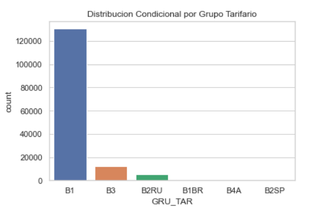

# Analisis-y-Visualizacion-
Analisis de calidad de suministro electrico

1 - Analisis General¶
Cuantas entradas posee el dataset y que representa cada una?  
40 (original), 28 (eligidos),   
Glossary: (Guillermo) TABLA  

nombre | traduccion | descripcion | numerica/categorica

Si queremos analizar calidad de servicio cual seria a su parece la variable de salida?
FIC o DIC? 

2 - Analisis Estadistico  
Cuales son las variables numericas? TABLA 

Guillermo 
Cuanto valen los principales estadisticos? 
Existen valores que no sean validos? Cuales? Que se puede hacer en esos casos?  
Poseen outliers? Que tecnicas se pueden utilizar para mitigar su impacto.  
Como es la distribucion de los valores? Son normales?  
Calcule los principales estadisticos despues del preprocesamiento.  
Adicione los graficos o tablas que considere oportuno para graficar los puntos anteriores.  

**Cuáles son las variables categóricas? Cuál es la cardinalidad de las mismas?**

* CONJ, que si bien es numérica es sólo un código; su orden numérico no nos es útil. Su cardinalidad es de 6.
* BRR, con cardinalidad 706.
* CLAS_SUB, con cardinalidad 28.
* CNAE, con cardinalidad 142.
* FAS_CON, con cardinalidad 9.
* GRU_TEN, con cardinalidad 1.
* TEN_FORN, con cardinalidad 1.
* GRU_TAR, con cardinalidad 6.
* ARE_LOC, con cardinalidad 3.
* SIT_ATIV, con cardinalidad 2.

Con respecto a PAC: su cardinalidad es 145433. Este es un número muy alto, cercano al cardinal del conjunto de datos. La razón es que suele haber sólo un punto de acoplamiento para cada unidad consumidora. Por esta razón, me parece que no debería considerarse variable categórica; si fuese así la gran mayoría de las categorías tendría un solo elemento.

A pesar de que DAT_CON no es numérica no puedo considerarla categórica ya que contiene pares fecha-hora, los cuales pueden resultarnos útiles si están ordenados.

**En base a la respuesta anterior, ¿vale la manera mantenerlas a todas?**

Creo que GRUN_TEN y TEN_FORN no valen la pena, ya que todas las unidades pertenecen al mismo grupo de tensión (BT, "Baja Tensión") y tienen el mismo código de tensión de suministro (22).

**Cuáles son los 3 valores más comunes de cada categoría?**

| Variable | Valor más común              | Segundo valor más común             | Tercer valor más común       |
| -------- | ---------------------------- | ----------------------------------- | ---------------------------- |
| CONJ     | 15602 (42090 consumidores)   | 12737 (32909 consumidores)          | 12743 (28465 consumidores)   |
| MUN      | 2802106 (30785 consumidores) | 2807402 (22570 consumidores)        | 2803005 (16067 consumidores) |
| BRR      | CENTRO (20614 consumidores)  | TOBIAS BARRETO (10151 consumidores) | RIO REAL (9913 consumidores) |
| CLAS_SUB | RE1 (99475 consumidores)     | RE2 (31682 consumidores)            | CO1 (6860 consumidores)      |
| CNAE     | 0 (148046 consumidores)      | 6190601 (101 consumidores)          | 9491000 (57 consumidores)    |
| FAS_CON  | AN (96082 consumidores)      | BN (21575 consumidores)             | CN (12284 consumidores)      |
| GRU_TEN  | BT (148801 consumidores)     |                                     |                              |
| TEN_FORN | 22 (148801 consumidores)     |                                     |                              |
| GRU_TAR  | B1 (130596 consumidores)     | B3 (12297 consumidores)             | B2RU (5001 consumidores)     |
| ARE_LOC  | UB (87973 consumidores)      | NU (60790 consumidores)             | 0 (38 consumidores)          |
| SIT_ATIV | AT (145609 consumidores)     | DS (3192 consumidores)              |                              |

**Escoja dos variables y grafique sus niveles contra la cantidad de apariciones.**

TO-DO Javi

Brandon  
**Cuando sea posible calcule la correlacion entre cada variable y la salida, y entre variables.**  

El primer paso en establicer un relacion predictivo es identificar correlacion entre variables, definiendo nuestros variables independientes (x) y dependientes (y). 
Usamos "correlation ratio", un valor entre 0 y 1 que nos da un idea la probabilidad de que un valor numerica puede estar predicho por su valor categorica. En general DIC nos dio resultados como con salida con correlation mas grande.
| entrada | salida| correlation ratio|
| -------- | ------------------------|
|x='CONJ'|y='DIC'|0.212|
|x='ARE_LOC'|"DIC"|0.427|
|x='GRU_TAR'|"DIC"|0.101|
|x='CNAE'|y='DIC'|0.038|
|x='CAR_INST'|y='DIC'|0.277|
|x='ENE_01'|y='DIC'|0.15|

**Cual es la variable de mayor correlacion con la salida.**  
Segun a este experimento, la área donde se ubica la unidad de consumo, ARE_LOC, tiene mayor correlacion con DIC. Tambien notable son las correlacciones de activadad economico, CNAE, y departemento donde esta ubicado el consumido, CONJ, con DIC. 

**Escoja una variable categorica y calcule las distribuciones condicionales para cada nivel de la misma.**  
Eligimos la variable GRU_TAR (grupo tarifario) para comparar la distribucion en la dataset. 
| GRU_TAR | Conditional Distribution|
|----|------|
| B1 | 0.878|
| B3 | 0.083|
| B1 | 0.034|
| B1 | 0.006|
| B1 | 0.000|
| B1 | 0.000|

Vemos que la gran mayoria, 88 por ciento, esta en rate group B1.

**Como podemos saber si las distribuciones condicionales son diferentes entre ellas?**  

3 - Preguntas  

Brandon  
Calcule el consumo total anual de cada consumidor.  
Existe correlacion entre consumo y frecuencia de corte de servicio (FIC)?  
Como varia el servicio entre zonas urbanas y rurales?  
Como varia el consumo entre zonas urbanas y rurales?  

Javier  
Cuales son 10 actividades economicas mas comunes de la region?  
Dentro de ellas:  
Cuales tienen mayor y menor frecuencia de corte  
Cuales son las de mayor y menor consumo?  