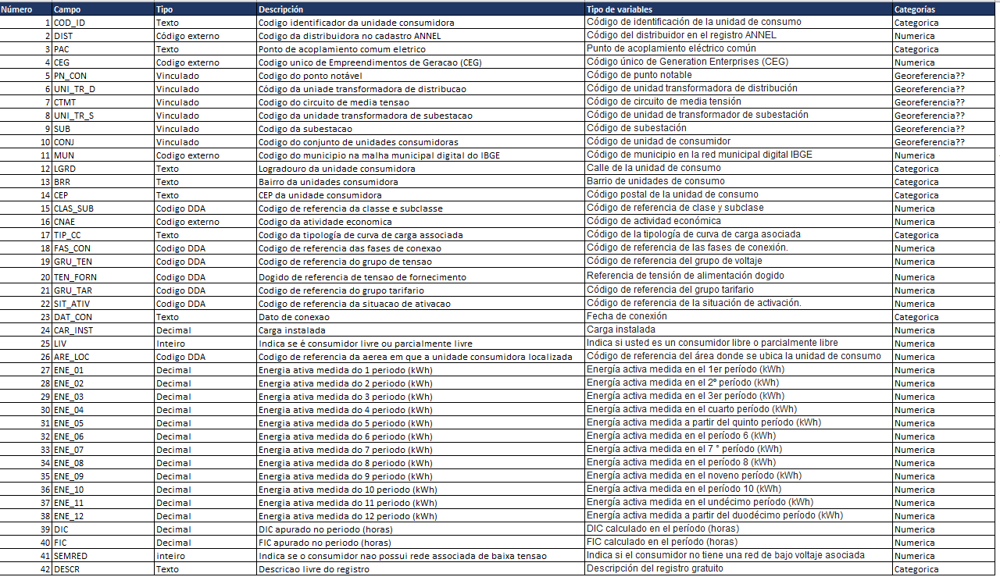
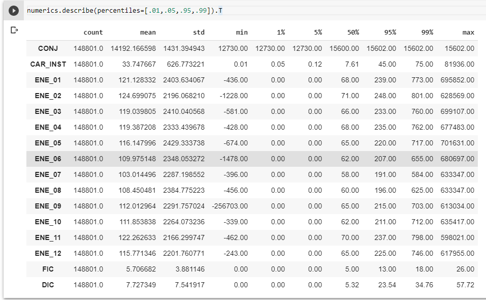
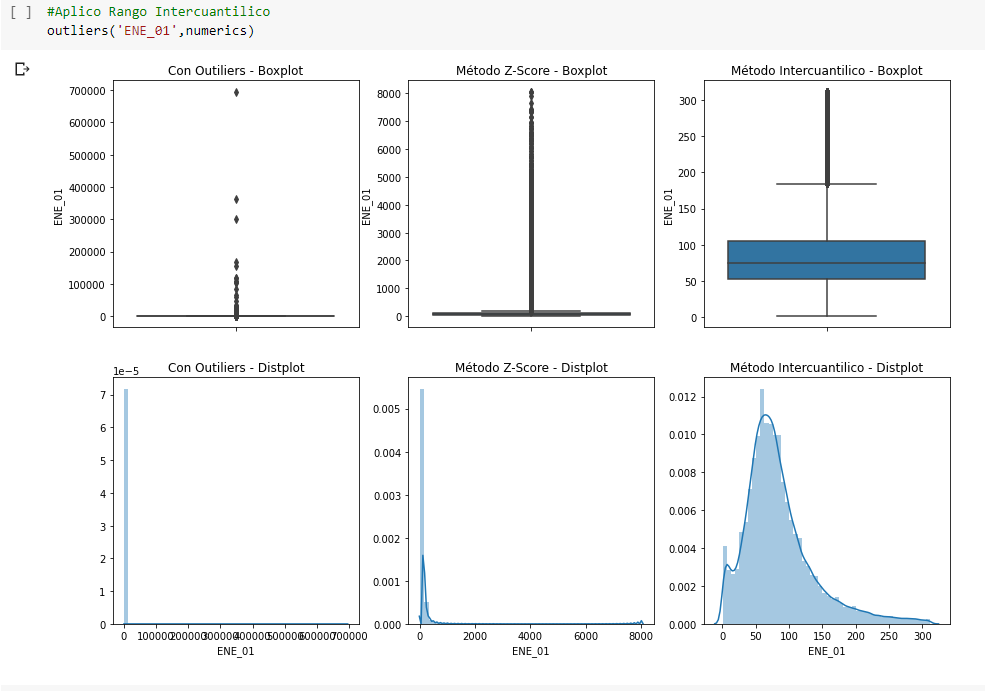
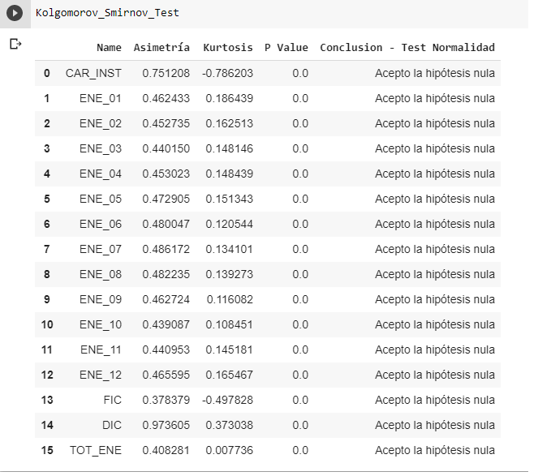
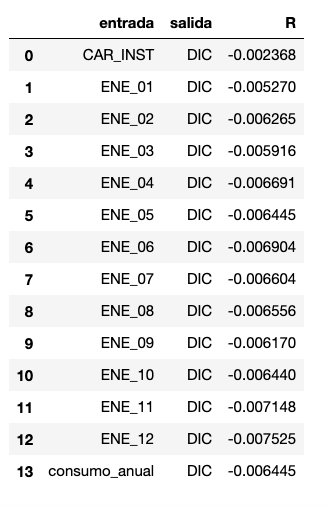
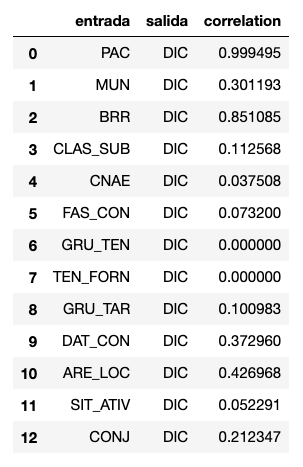
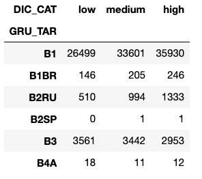
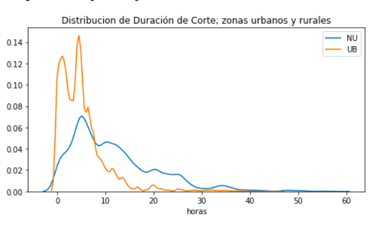

# Analisis-y-Visualizacion-
#### Analisis de calidad de suministro electrico

## Aplicacion de ML sobre datos georeferenciados
#### Mentoria: Diplomatura Ciencias de Datos, FAMAF, 2020

Practico del grupo **Javier Gallo**, **Guillermo Coseani** y **Brandon Janes**.

## 1 - Analisis General¶
**Cuantas entradas posee el dataset y que representa cada una?** <br>
**Cuales son las variables numericas?** <br>
El conjunto de datos original tenía 40 entradas. Se las tradujo al español para saber en que consistían cada una de ellas. De estas se eligieron 28



**Si queremos analizar calidad de servicio cual seria a su parece la variable de salida?
FIC o DIC?**<br>
Eligimos duración de corte "DIC" como salida porque vimos un poco más correlación que encontramos usando frequencia de corte "FIC" como salida. 

## 2 - Analisis Estadistico <br>

**Cuanto valen los principales estadisticos?**
Se procedió a calcular los principales estadísticos a través del método describe( ) entre los que se incluyó las medidas: media, min, max, desviación estándar y los percentiles (5,50,95).



**Existen valores que no sean validos? Cuales? Que se puede hacer en esos casos?**
Las variables numéricas no tienen datos perdidos, pero si inválidos en el caso de consumo ya que las variables solamente pueden adoptar valores positivos mientras que en el conjunto de datos se observan que hay observaciones que poseen valores negativos en alguno de los consumos. Para ello se procedió a usar una mascara en la que se eliminen todas aquellas observaciones que tengan al menos un consumo negativo durante el mes.

**Poseen outliers? Que tecnicas se pueden utilizar para mitigar su impacto.** 
Las variables numéricas poseen **outliers**. Para eliminarlo surgen dos técnicas tradicionales: **Z-Score** y el rango intercuantilico (IQR).
La función Z-Score que vincula la media y la desviación estándar removiéndose aquellos valores que se encuentran fuera del rango de +/-3 desviaciones estándar de la media.

El **rango intercuantilico** (IQR) se calcula en primer lugar la distancia entre los cuantiles c.25 y c.75 (IQR = c.75- c.25) para luego desechar aquellos valores que se encuentren por fuera del rango (c.25-1.5*QR, c.75+1.5*IQR)
Se hizo una función que nos permitiera visibilizar cual de las técnicas se adaptaba a nuestras necesidades donde se encuentran los gráficos de caja y distribución para la variable original, la variable filtrada a través del método Z-Score y el método IQR. En todos los casos se arribó a la misma conclusión en la que él método de eliminación de outiliers que mejor se adaptaba a nuestras necesidades era IQR.



Una vez que se seleccionó el método IQR se procedió a eliminar todas las observaciones que tuvieran outliers en alguna de las variables numéricas. 

**Como es la distribucion de los valores? Son normales?**
Para observar la distribución se procedió a usar las medidas de Curtosis y Asimetría. Todas las variables resultaron tener asimetría positiva. Al mismo tiempo respecto de la curtosis, FIC fue la única que asumió valor negativo (distribución levemente platicúrtica) mientras que el resto de las variables numéricas resultaron tener curtosis levemente positiva. 
Para probar la hipótesis de normalidad se recurrió al test de Kolgomorov-Smirnov en el que la hipótesis nula supone “Normalidad de la distribución”. En todos los casos las variables aceptaron la hipótesis nula con un alfa de 5%.



**Cuáles son las variables categóricas? Cuál es la cardinalidad de las mismas?**

* CONJ, que si bien es numérica es sólo un código; su orden numérico no nos es útil. Su cardinalidad es de 6.
* BRR, con cardinalidad 706.
* CLAS_SUB, con cardinalidad 28.
* CNAE, con cardinalidad 142.
* FAS_CON, con cardinalidad 9.
* GRU_TEN, con cardinalidad 1.
* TEN_FORN, con cardinalidad 1.
* GRU_TAR, con cardinalidad 6.
* ARE_LOC, con cardinalidad 3.
* SIT_ATIV, con cardinalidad 2.

Con respecto a PAC: su cardinalidad es 145433. Este es un número muy alto, cercano al cardinal del conjunto de datos. La razón es que suele haber sólo un punto de acoplamiento para cada unidad consumidora. Por esta razón, me parece que no debería considerarse variable categórica; si fuese así la gran mayoría de las categorías tendría un solo elemento.

A pesar de que DAT_CON no es numérica no puedo considerarla categórica ya que contiene pares fecha-hora, los cuales pueden resultarnos útiles si están ordenados.

**En base a la respuesta anterior, ¿vale la manera mantenerlas a todas?**

Creo que GRUN_TEN y TEN_FORN no valen la pena, ya que todas las unidades pertenecen al mismo grupo de tensión (BT, "Baja Tensión") y tienen el mismo código de tensión de suministro (22).

**Cuáles son los 3 valores más comunes de cada categoría?**

| Variable | Valor más común                          | Segundo valor más común                        | Tercer valor más común                       |
| -------- | ---------------------------------------- | ---------------------------------------------- | -------------------------------------------- |
| CONJ     | 15602 (42090 consumidores)               | 12737 (32909 consumidores)                     | 12743 (28465 consumidores)                   |
| MUN      | 2802106 ("Estância", 30785 consumidores) | 2807402 ("Tobias Barreto", 22570 consumidores) | 2803005 ("Itabaianinha", 16067 consumidores) |
| BRR      | CENTRO (20614 consumidores)              | TOBIAS BARRETO (10151 consumidores)            | RIO REAL (9913 consumidores)                 |
| CLAS_SUB | RE1 (99475 consumidores)                 | RE2 (31682 consumidores)                       | CO1 (6860 consumidores)                      |
| CNAE     | 0 (148046 consumidores)                  | 6190601 (101 consumidores)                     | 9491000 (57 consumidores)                    |
| FAS_CON  | AN (96082 consumidores)                  | BN (21575 consumidores)                        | CN (12284 consumidores)                      |
| GRU_TEN  | BT (148801 consumidores)                 |                                                |                                              |
| TEN_FORN | 22 (148801 consumidores)                 |                                                |                                              |
| GRU_TAR  | B1 (130596 consumidores)                 | B3 (12297 consumidores)                        | B2RU (5001 consumidores)                     |
| ARE_LOC  | UB (87973 consumidores)                  | NU (60790 consumidores)                        | 0 (38 consumidores)                          |
| SIT_ATIV | AT (145609 consumidores)                 | DS (3192 consumidores)                         |                                              |

**Escoja dos variables y grafique sus niveles contra la cantidad de apariciones.**

Variable FAS_CON (códigos de referencia de fases de conexión):


Variable GRU_TAR (grupos tarifarios):


**Cuando sea posible calcule la correlacion entre cada variable y la salida, y entre variables.** <br>

Buscamos un test de correlación entre la variable **DIC** (numerica) como salida con cada una de las otras variables como entradas. Eligimos duración de corte "DIC" como salida porque vimos un poco más correlación que encontramos usando frequencia de corte "FIC" como salida. 

Para identificar una correlación entre dos variables numericas podemos calcular la coeficiente de correlación de Pearson, **r**. Para identificar una correlación entre una variable numerica (DIC) y una variable categorica en principio probamos la one-way ANOVA test que nos dió un p-valor de cero para cada test que hicimos con las variables categoricas y DIC. El p-valor de cero significa que existe un riesgo del 0 por ciento de concluir que las variables estan correlacionados con **DIC** cuando no estan correlacionados con **DIC**. Pero esos resultados nos pareció raros. 

Como alternativa encontramos una formación de la formula del coeficiente de correlación modificado para poder calcular una variable categórica parecido al R. Segun a un articulo [Shaked Zychlinski](https://towardsdatascience.com/the-search-for-categorical-correlation-a1cf7f1888c9), su formula calcula "la varianza ponderada de la media de cada categoría dividida por la varianza de todas las muestras", que similar de **r**. Con estos resultados podemos ver cual variable categorica tiene correlación mas fuerte con DIC que es la zona rural o urbano **ARE_LOC**.  

### Numeric con numeric: coeficiente de correlacion o "R"



### Categorical con numeric (DIC): weighted variance



**Cual es la variable de mayor correlacion con la salida.** <br>
Según a este experimento, "la área donde se ubica la unidad de consumo", ARE_LOC, tiene mayor correlacion con DIC. También notable son las correlacciones de activadad economico, CNAE, y departemento donde esta ubicado el consumido, CONJ, con DIC. 

**Escoja una variable categorica y calcule las distribuciones condicionales para cada nivel de la misma.** <br>
Eligimos la variable GRU_TAR (grupo tarifario). Primero categorizamos la variable DIC en tres categorias low, medium y high, para generar la tabla de frequencia (abajo) que muestra la frequencia de duracion de corte o DIC categorizado en low, medium y high condicional a que grupo tarifario o GRU_TAR esta el consumidor.  

**Como podemos saber si las distribuciones condicionales son diferentes entre ellas?**

### Distribución condicional para DIC en GRU_TAR

La tabla muestra la disribución de low, med y high DIC (duración de corte) en porcentaje de categoria dado una cierta grupo tarifario, GRU_TAR.



**P(un cliente en GRU_TAR B1 ∣ tiene medium duracion de corte)**
total = 109,463<br>
P(B1) = 96030/109463 = 0.877<br>
P(medium) = (38254/109463) = 0.3494<br>
P(B1|medium) = 33601/109463) y las variables estan independientes.<br>

Probabilidad que un cliente en GRU_TAR B1 tiene medium duracion de corte: 0.306<br>

## 3 - Preguntas <br>

**Calcule el consumo total anual de cada consumidor.** <br>

Con un simple "for loop" se puede calcular el consumo total anual de cada consumidor.<br>
```
annual_totals = []
for index, row in data.iterrows():
    annual_total = row.ENE_01+row.ENE_02+ \
     row.ENE_03+row.ENE_04+row.ENE_05+ \
    row.ENE_06+row.ENE_07+row.ENE_08+ \
    row.ENE_09+row.ENE_10+row.ENE_11+ \
    row.ENE_02
    annual_totals.append(annual_total)
print(annual_totals[:10])
```
Despues podes agregar la lista ```annual_totals``` a tu dataset como una nueva columna ```data['consumo_anual'] = annual_totals```.<br>

* El promedio de consumo por consumidor era ```data.consumo_anual.mean()= 1392.671```kWh, 
* maximum ```data.consumo_anual.max()= 7825074.0```
* el desvio estandar ```data.consumo_anual.std()= 27441.344``` .<br>

**Como varia el servicio entre zonas urbanas y rurales?** <br>
Segun a este heatmap, la duración del corte es mas larga en zonas rurales que zonas urbanos. 


**Como varia el consumo entre zonas urbanas y rurales?** <br>
Segun a este heatmap, el consumo anual es mas larga en zonas rurales que zonas urbanos.


**Cuáles son las diez actividades económicas más comunes de la región?**

Para más del 99% de los consumidores de este conjunto de datos (unidades consumidoras de baja tensión) no se registra actividad económica. Entre el resto -- una proporción muy pequeña -- estas son las diez actividades más comunes:

* 101 consumidores son **proveedores de accesso a redes de comunicaciones** (código 6190-6/01).
* 57 consumidores en **actividades de organizaciones religiosas** (código 9491-0/00).
* 43 consumidores en el **área de construcción de edificios** (código 4120-4/00).
* 38 consumidores en el **área de servicios de comunicación multimedia** (código 6110-8/03).
* 37 consumidores en **actividades odontológicas** (código 8630-5/04).
* 30 consumidores en **asociaciones de defensa de los derechos sociales** (código 9430-8/00).
* 28 consumidores en **incorporación de emprendimientos inmobiliarios** (código 4110-7/00).
* 27 consumidores en **captación, tratamiento y distribución de agua** (código 3600-6/01).
* 23 consumidores en **administración pública en general** (código 8411-6/00).
* 19 consumidores con **criaderos de ganado para faena** (código 0151-2/01).

**Dentro de ellas:**

**Cuáles tienen mayor y menor frecuencia de corte?**

* La mayor frecuencia de corte la tiene, sin dudas, el **área de construcción de edificios** (código 4120-4/00) con el 86% de las unidades consumidoras reportando de 9 a 12 cortes (mensuales?).
* La menor frecuencia de corte la tiene el área de **incorporación de emprendimientos inmobiliarios** (código 4110-7/00) con el 86% de las unidades consumidoras reportando 4 cortes (mensuales?) o menos.

**Cuáles son las de mayor y menor consumo?**

* La actividad que más consume es el **área de construcción de edificios** (código 4120-4/00) con 251130 kWh anuales.
* La actividad que menos consume es el área de **incorporación de emprendimientos inmobiliarios** (código 4110-7/00) con 13866 kWh anuales.
